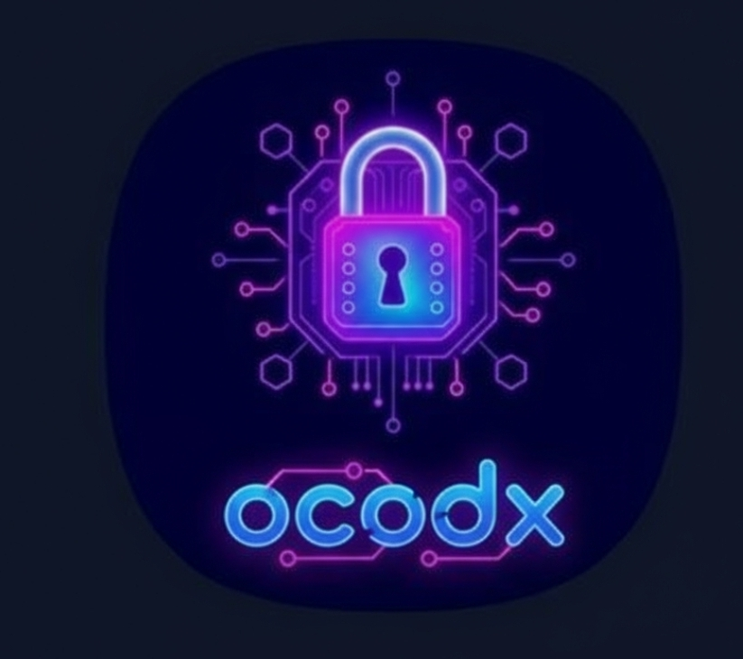

<div align="center">
  
  <h1>OCX (OcodX)</h1>
  <p><strong>Privacy-focused Encrypted Messaging & Image App</strong></p>
  <p>Secure encryption with local processing—zero data storage, 100% private.</p>
</div>

---

## 🔒 About the App

**OCX** is an uncompromising client-side encryption platform designed to secure your most sensitive communications. Built around a strict *zero-knowledge* architecture, OCX ensures your data, passwords, and encryption keys never travel in an unencrypted state to any remote servers. Every AES-256-GCM encryption and decryption process happens locally on your device.

Whether seeking to protect private exchanges, safeguarding critical conversations, or acting as someone demanding uncompromising digital privacy, OCX equips you with multiple layers of military-grade encryption through a beautifully streamlined interface.

## ✨ Key Features

- **🛡️ Client-Side Text Encryption**
  Relies on industry-standard AES-256-GCM encryption paired with time-limited keys. The text processes completely within your browser and even works offline.
  
- **🖼️ Secure Image Sharing**
  Encrypt visual data directly on your device. Generate expiring 6-character access codes to share images swiftly and securely.
  
- **💬 Ephemeral Rooms**
  Real-time private chat environments. The exact moment a room is emptied of its participants, all session data and chat history are permanently wiped into the void. It retains zero histories.
  
- **🎮 Gamified Premium Capabilities**
  Earn platform credits by actively engaging in built-in cognitive exercises (Memory Challenge, Symbol Match, Flash Number) to unlock advanced tiers naturally like image encryption and unlimited ephemeral rooms. 

- **🚦 Community Safeguards (Without Tracking)**
  Integrates a thorough content filtering system running entirely client-side, alongside full user blocking and reporting mechanics—upholding community health without compromising the zero-tracking structure.

## 🚀 Built With

- **Frontend Framework:** React 18, Vite
- **Language:** TypeScript
- **Styling:** Tailwind CSS, shadcn-ui
- **PWA / App Store Ready:** PWABuilder & Capacitor configuration 

## 📦 Local Development

To clone and run OCX locally, follow these steps:

### Prerequisites:
Ensure you have [Node.js](https://nodejs.org/) installed on your machine.

```sh
# Clone the repository
git clone https://github.com/FinalGlowAI/cozy-cipher-chat.git

# Navigate into the project directory
cd cozy-cipher-chat

# Install dependencies utilizing npm/bun
npm install

# Start the active Vite development server
npm run dev
```

For iOS/Android preparation using Capacitor, ensuring that `PWA` guidelines and native bundles sync respectively:

```sh
# Synchronize app bundles after pushing an active build
npm run build
npx cap sync
```

## 📱 App Store & PWABuilder Readiness
OCX is structurally optimized to be an installable Progressive Web App (PWA) with native-level shortcuts directly built into the manifest (`Encrypt Message`, `Decrypt Message`, `Image Encryption`, `Ephemeral Chat`). It is built to seamlessly wrap via PWABuilder passing stringent **App Store Completeness** and functional app guidelines. 
